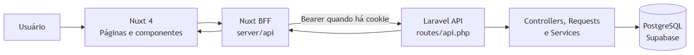
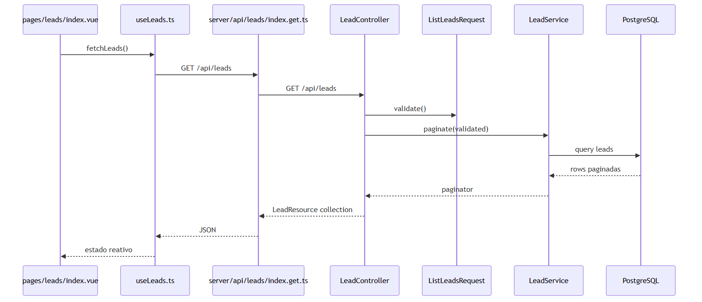

# Arquitetura e comunicação

## Arquitetura observada

Fonte editável: [system-architecture.mmd](diagrams/system-architecture.mmd).

O Nuxt funciona como BFF. Páginas e composables chamam rotas locais em `frontend/server/api/`; essas rotas usam `frontend/server/utils/laravel.ts` para chamar a API Laravel. O token Sanctum é guardado no cookie `mvp_session`, `HttpOnly`, pelo BFF, e não é disponibilizado ao JavaScript do navegador.

## Caminho de uma operação de lead

Fonte editável: [request-flow.mmd](diagrams/request-flow.mmd).

Exemplo: listagem de leads.

1. `frontend/app/pages/leads/index.vue` utiliza `useLeads()`.
2. `frontend/app/composables/useLeads.ts` inicia `GET /api/leads` no Nuxt, controla `loading`, `refreshing`, `error`, cancelamento e URL de filtros.
3. `frontend/server/api/leads/index.get.ts` encaminha query strings para `fetchLaravel()`.
4. `frontend/server/utils/laravel.ts` adiciona `Authorization: Bearer` quando há cookie e chama `GET /api/leads` no Laravel.
5. `backend/routes/api.php` encaminha a `LeadController::index()`.
6. `ListLeadsRequest` valida filtros; `LeadService::paginate()` monta a consulta Eloquent; `LeadResource` retorna o contrato camelCase.
7. O composable atualiza o estado reativo e `LeadTable.vue` renderiza a resposta.

Criação e atualização seguem o mesmo caminho, trocando o método e usando `StoreLeadRequest` ou `UpdateLeadRequest`; a regra de cálculo é aplicada por `LeadService::withDerivedAttributes()` antes de persistir o modelo.

## Validações e respostas

- **Nuxt:** `LeadForm.vue` aplica validações de experiência do usuário para os campos básicos e mostra erros retornados pela API. `LeadFilters.vue` apenas serializa filtros.
- **Laravel:** Form Requests definem a validação oficial. A API transforma leads com `LeadResource`, interações com `LeadInteractionResource` e dashboard com `DashboardResource`.
- **Erros:** `fetchLaravel()` encapsula erros upstream em `createError`. As páginas exibem mensagens genéricas, sem stack trace.

## Persistência

`Lead`, `LeadInteraction`, `User` e `Organization` são modelos Eloquent. As migrations criam `organizations`, `users`, `leads`, `lead_interactions`, tabelas de tokens/caches/jobs e índices para os filtros e agregações atuais. As datas de lembrete são calculadas em `America/Sao_Paulo` e comparadas em UTC nos serviços de leads e dashboard.

## Autenticação atual

O fluxo de autenticação está implementado, apesar de ainda não proteger os endpoints de negócio. `AuthService::register()` cria organização e usuário em transação e emite token. `AuthService::login()` verifica `is_active` e senha. `logout` e `me` estão sob `auth:sanctum`; as demais rotas de leads e dashboard estão públicas no arquivo atual de rotas.

Essa diferença é intencionalmente registrada como pendência, não tratada como isolamento já implementado.
