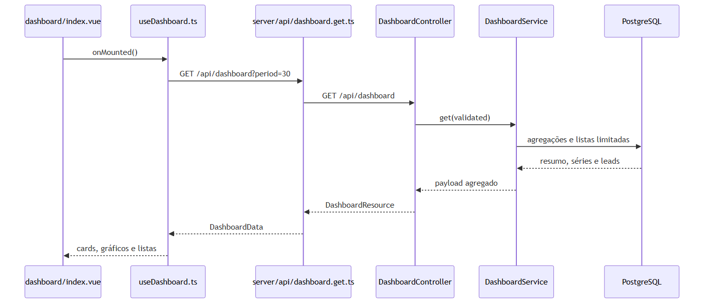

# Módulo de dashboard

O dashboard consolida a situação comercial atual. A página é `frontend/app/pages/dashboard/index.vue`, protegida pelo middleware Nuxt `auth`, e consome o BFF `GET /api/dashboard` por meio de `useDashboard()`.



Fontes: [fluxo de dados](diagrams/dashboard-flow.mmd) e [estados da interface](diagrams/dashboard-states.mmd).

| Diagrama | PNG |
| --- | --- |
| Carregamento do dashboard | [dashboard-flow.png](diagrams/dashboard-flow.png) |
| Estados de interface | [dashboard-states.png](diagrams/dashboard-states.png) |

## Contrato

O Laravel expõe `GET /api/dashboard`, atendido por `DashboardController::show()`, validado por `DashboardRequest`, calculado por `DashboardService::get()` e serializado em `DashboardResource`.

```text
summary
status_distribution
lead_evolution
insurance_distribution
priority_leads
upcoming_contacts
meta
```

`meta` contém `period`, `date_from`, `date_to` e `generated_at`. O padrão é 30 dias; o backend aceita `period` 7, 30, 90 ou 365, intervalo de datas, `insurance_type` e `assigned_user_id`.

O Nuxt modela o retorno em `frontend/app/types/dashboard.ts`. A interface atual oferece somente o seletor de período. Veja [métricas](metrics.md) e [fluxo de dados](data-flow.md).
