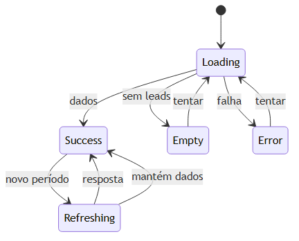

# Fluxo de dados e estados do dashboard

## Carregamento

1. `pages/dashboard/index.vue` obtém `dashboard`, filtros e estados de `useDashboard()`.
2. Na montagem, o composable chama `/api/dashboard` com o período atual.
3. `frontend/server/api/dashboard.get.ts` encaminha os parâmetros a `fetchLaravel()`.
4. O Laravel devolve uma resposta agregada única.
5. A página distribui a resposta para cards, gráficos e listas sem recomputar métricas no navegador.

O composable usa `requestId` e `AbortController`: quando o período muda rapidamente, a solicitação anterior é abortada e uma resposta antiga não sobrescreve a mais recente. A URL recebe `period` quando ele não é 30.

## Estados de interface

- **Primeiro carregamento:** `loading=true`; cards, gráficos e listas exibem `Skeleton` sem números de exemplo.
- **Atualização de período:** dados anteriores permanecem visíveis; `refreshing=true` mostra indicador textual e ponto pulsante nos cards.
- **Dashboard sem leads:** `summary.total_leads === 0` apresenta `EmptyState` e ação para `/leads/novo`.
- **Período sem dados:** cada gráfico apresenta mensagem neutra; listas continuam refletindo contatos atuais, pois não dependem do intervalo de evolução.
- **Erro inicial:** não renderiza números zerados; mostra alerta e botão Tentar novamente.
- **Erro na atualização:** mantém a última resposta e informa que ela pode estar desatualizada.

Não há fallback mockado. Os dados de gráfico só são renderizados se houver valores válidos; a rosca não recebe segmentos de zero.

## Limites atuais

Embora o backend aceite `date_from`, `date_to`, `insurance_type` e `assigned_user_id`, `useDashboard()` atualmente envia somente `period`. A autenticação do layout Nuxt não equivale à proteção da rota Laravel: `GET /api/dashboard` está pública no backend atual.
