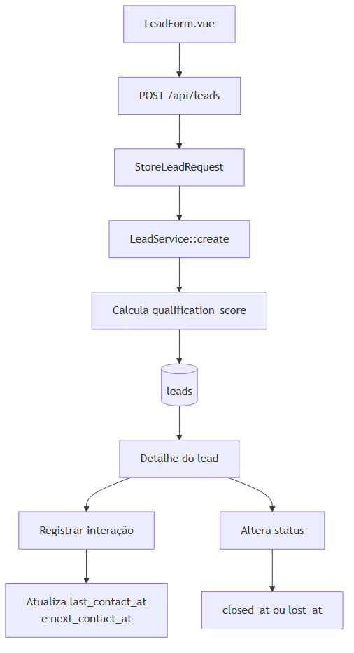

# Módulo de leads

## Responsabilidade

O módulo concentra oportunidades comerciais: cadastro, busca, acompanhamento, qualificação, status e interações. Um lead percorre as etapas `novo`, `contatado`, `em_negociacao`, `aguardando_cliente`, `fechado` ou `perdido`.

Fontes: [fluxo](diagrams/lead-flow.mmd), [entidades](diagrams/lead-entity.mmd), [ciclo de status](diagrams/lead-status.mmd) e [cálculo](diagrams/scoring-flow.mmd).

| Diagrama | PNG |
| --- | --- |
| Fluxo de cadastro e acompanhamento | [lead-flow.png](diagrams/lead-flow.png) |
| Modelo de entidades | [lead-entity.png](diagrams/lead-entity.png) |
| Ciclo comercial predominante | [lead-status.png](diagrams/lead-status.png) |
| Cálculo da qualificação | [scoring-flow.png](diagrams/scoring-flow.png) |

O ciclo de status ilustra o caminho comercial predominante. No código, `LeadService` aceita alteração manual para qualquer um dos valores válidos; estados terminais não são bloqueados por uma máquina de estados.

## Interface e responsabilidades

| Área | Arquivos reais | Responsabilidade |
| --- | --- | --- |
| Lista | `frontend/app/pages/leads/index.vue`, `LeadFilters.vue`, `LeadTable.vue`, `useLeads.ts` | Busca, filtros, paginação, exclusão e navegação. |
| Cadastro/edição | `pages/leads/novo.vue`, `pages/leads/[id]/editar.vue`, `LeadForm.vue` | Coleta e validação de experiência do usuário. |
| Detalhe | `pages/leads/[id]/index.vue`, `useLead.ts` | Dados do lead e histórico. |
| Interações | `LeadInteractions.vue`, `useLead.ts` | Criar, editar e excluir contatos. |
| API | `LeadController`, `LeadInteractionController`, `LeadService`, `LeadInteractionService` | Regras e persistência. |

## Fluxos principais

### Cadastro

`LeadForm.vue` emite um `LeadInput`; `pages/leads/novo.vue` chama `useLeads().createLead()`, que usa o BFF `POST /api/leads`. O Laravel valida com `StoreLeadRequest`, chama `LeadService::create()` e devolve `LeadResource` com HTTP 201. Depois do sucesso, o frontend navega para `/leads/{id}`.

### Edição e status

`useLead().saveLead()` ou `useLeads().updateLead()` envia `PUT /api/leads/{id}`. `LeadService::withDerivedAttributes()` determina `closed_at` ao entrar em `fechado`, `lost_at` ao entrar em `perdido` e limpa esses dados quando o status deixa de ser terminal. As notas individuais alteram a nota calculada; `qualification_score` enviado pelo cliente é ignorado.

### Busca e paginação

`useLeads()` espera 350 ms para busca, sincroniza filtros na URL e cancela a requisição anterior por `AbortController`. `LeadService::paginate()` aceita busca por nome, e-mail ou telefone, status, seguro, urgência, origem, responsável, período de contato, nota mínima/máxima e ordenação. O retorno é paginado pela collection de `LeadResource`.

### Exclusão

`DELETE /api/leads/{lead}` chama `LeadController::destroy()`, que usa soft delete. O lead deixa de aparecer nas consultas comuns por causa de `SoftDeletes` do modelo.

### Relação com dashboard

`DashboardService` consulta a mesma tabela `leads` para indicadores, distribuição, evolução e listas. Leads fechados e perdidos são excluídos das listas de contatos. A nota é exibida como qualificação comercial, não previsão de conversão.

Consulte [modelo de dados](data-model.md), [API](API.md), [qualificação](scoring.md) e [interações](interactions.md).
