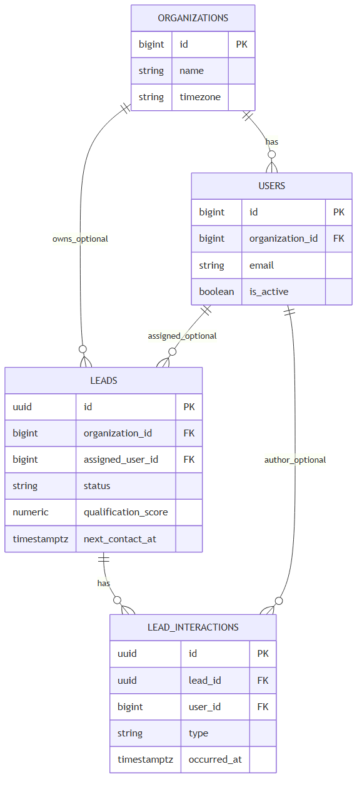

# Dados de leads e interações

## Entidades

A fonte é `backend/database/migrations/2026_07_22_155245_create_leads_table.php` e `2026_07_22_155250_create_lead_interactions_table.php`.

## Lead — `leads`

O modelo é `backend/app/Models/Lead.php`, com UUID, `SoftDeletes` e relações opcionais para organização, responsável, criador e interações.

### Cadastro básico — somente esta seção é exigida no cadastro inicial

| Campo API / frontend | Banco | Tipo | Regra | Finalidade |
| --- | --- | --- | --- | --- |
| `name` | `name` | string | obrigatório, máximo 255 | Identificação. |
| `phone` | `phone` | string(20) | obrigatório, 10–20 após normalização | Contato principal. |
| `email` | `email` | string nulo | e-mail válido | Contato opcional. |
| `insuranceType` | `insurance_type` | string | obrigatório; valores permitidos | Seguro de interesse. |
| `customInsuranceType` | `custom_insurance_type` | string nulo | texto opcional no backend atual | Complemento para `outro`. |
| `status` | `status` | string | padrão `novo` | Etapa comercial. |
| `source`, `sourceDetails` | `source`, `source_details` | string nulo | fonte em lista permitida | Origem do lead. |
| `generalNotes` | `general_notes` | text nulo | livre | Contexto inicial. |

### Perfil e qualificação — opcional

| Grupo | Campos armazenados |
| --- | --- |
| Perfil | `birth_date`, `city`, `state` (2 caracteres), `occupation`, `company_name`, `employment_type`, `income_range`. |
| Seguro atual | `has_current_insurance`, `current_insurer`, `current_policy_expires_at`. |
| Capacidade/necessidade | `estimated_asset_value`, `available_budget` (numéricos não negativos), `needs_description`, `preferred_contact_period`. |
| Avaliação | `financial_capacity_score`, `sales_viability_score`, `interest_level_score`, `availability_score` (inteiros de 1 a 5) e `qualification_score` (`numeric(3,1)`, derivado). |

### Priorização e acompanhamento — opcional

| Campo | Banco | Regra e finalidade |
| --- | --- | --- |
| `urgency` | `urgency` | `baixa`, `media` ou `alta`; entra na prioridade. |
| `nextContactAt` | `next_contact_at` | data/hora de follow-up. |
| `lastContactAt` | `last_contact_at` | derivado da interação mais recente. |
| `closedAt` | `closed_at` | definido pelo serviço ao status `fechado`. |
| `lostAt` | `lost_at` | definido pelo serviço ao status `perdido`. |
| `lossReason`, `lossReasonDetails` | `loss_reason`, `loss_reason_details` | motivo obrigatório na UI e no backend quando perdido. |
| `assignedUserId`, `createdBy` | `assigned_user_id`, `created_by` | FKs opcionais para `users`; não são atribuídas automaticamente no fluxo atual. |
| `organizationId` | `organization_id` | FK opcional para `organizations`; não é preenchida automaticamente no fluxo atual. |

Índices observados: organização, responsável, criador, seguro, urgência, nota, próximo contato, criação e composto `(status, next_contact_at)`.

## Interação — `lead_interactions`

O modelo `LeadInteraction` usa UUID e pertence a um lead; `user_id` é opcional. A tabela contém `type`, `description`, `occurred_at`, `next_contact_at`, timestamps e índice `(lead_id, occurred_at)`. A FK de `lead_id` possui cascata somente em exclusão física; exclusão lógica de lead não apaga as linhas de interações.

## Organização e usuário

`organizations` contém `id`, `name`, `timezone` (padrão `America/Sao_Paulo`) e timestamps. `users` contém `organization_id`, nome, e-mail único, senha, `is_active` e timestamps. A relação `Organization::users()` e `User::organization()` está implementada.

Consulte as limitações de isolamento no [relatório](../../reports/current-status.md).
