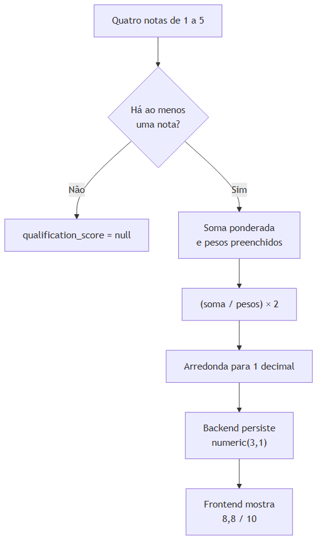

# Nota de qualificação

## Finalidade

A nota prioriza a atuação comercial. Ela **não** representa probabilidade matemática de fechamento. `null` significa **Não avaliado**.

## Critérios e pesos

| Critério | Campo | Escala | Peso |
| --- | --- | ---: | ---: |
| Capacidade financeira | `financial_capacity_score` | 1 a 5 | 25% |
| Viabilidade comercial | `sales_viability_score` | 1 a 5 | 30% |
| Nível de interesse | `interest_level_score` | 1 a 5 | 30% |
| Disponibilidade | `availability_score` | 1 a 5 | 15% |

Na interface, cada nota usa a referência 1 = muito baixo, 3 = médio e 5 = muito alto. O backend valida inteiros entre 1 e 5.



## Fórmula oficial

`LeadService::qualificationScore()` em `backend/app/Services/LeadService.php` calcula:

```text
nota = (
  capacidade × 0,25 + viabilidade × 0,30 + interesse × 0,30 + disponibilidade × 0,15
) / soma dos pesos preenchidos × 2
```

Com todos os critérios preenchidos, a soma dos pesos é 1. Se só alguns critérios forem informados, os pesos preenchidos são redistribuídos pela divisão. Sem nenhum critério, o resultado é `null`.

Exemplo completo: capacidade 5, viabilidade 4, interesse 5 e disponibilidade 3.

```text
(5×0,25 + 4×0,30 + 5×0,30 + 3×0,15) × 2 = 8,8
```

Resultado apresentado: `8,8 / 10`.

## Persistência, atualização e apresentação

- A coluna é `qualification_score numeric(3,1)`.
- `LeadService::withDerivedAttributes()` remove qualquer `qualification_score` enviado pelo cliente e o substitui pelo cálculo oficial em criação e atualização.
- A migration `2026_07_22_175058_recalculate_lead_qualification_scores.php` recalcula valores existentes a partir dos quatro critérios.
- `LeadResource` expõe `qualificationScore`; `QualificationBadge.vue` usa `formatQualificationScore()` e `qualificationClassification()`.
- Classificações: 0–3,9 baixa; 4–6,9 média; 7–8,4 boa; 8,5–10 alta.
- A listagem aceita `min_score` e `max_score`, e permite ordenar por `qualification_score`.

O frontend nunca envia o score final em `LeadInput`; somente envia os quatro critérios. O backend é a fonte oficial do resultado.
